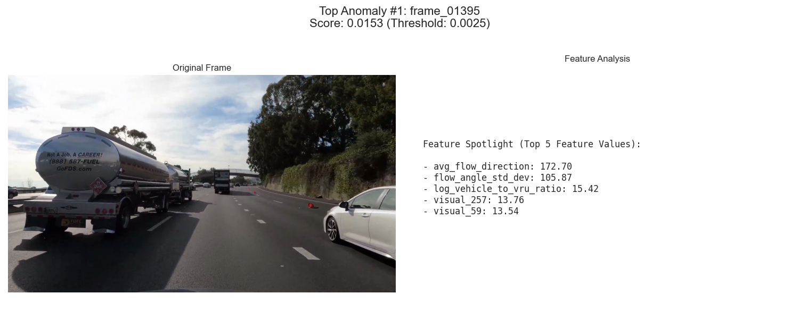
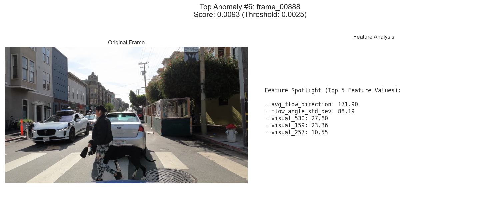
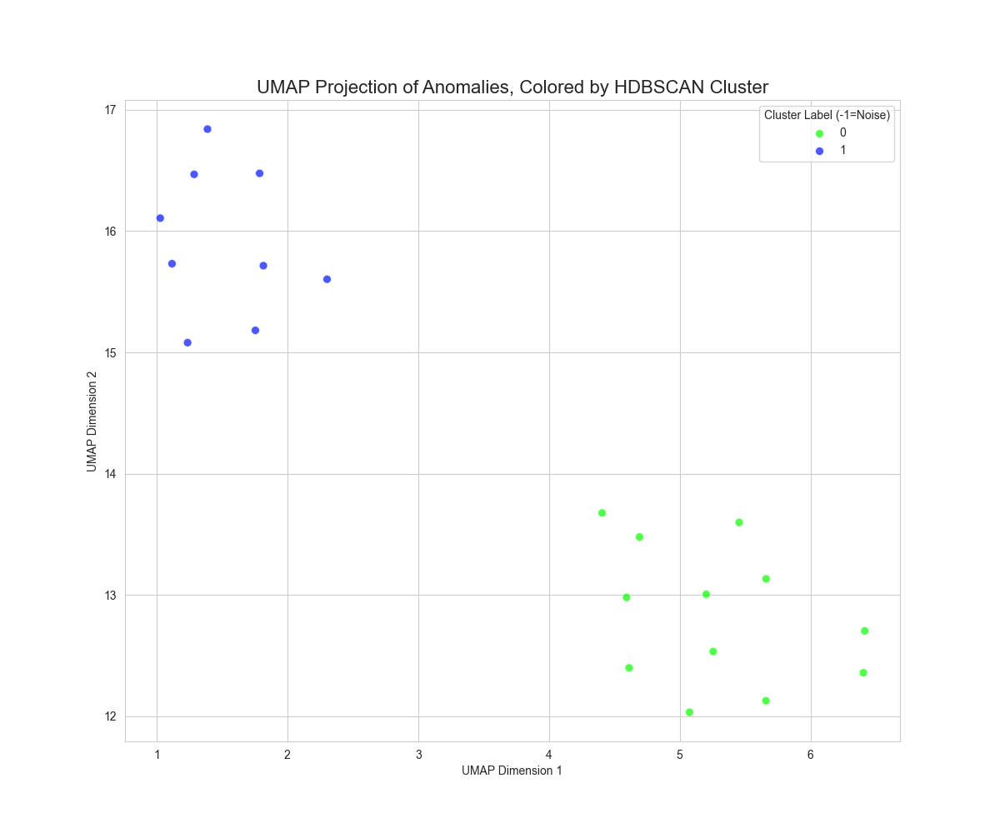
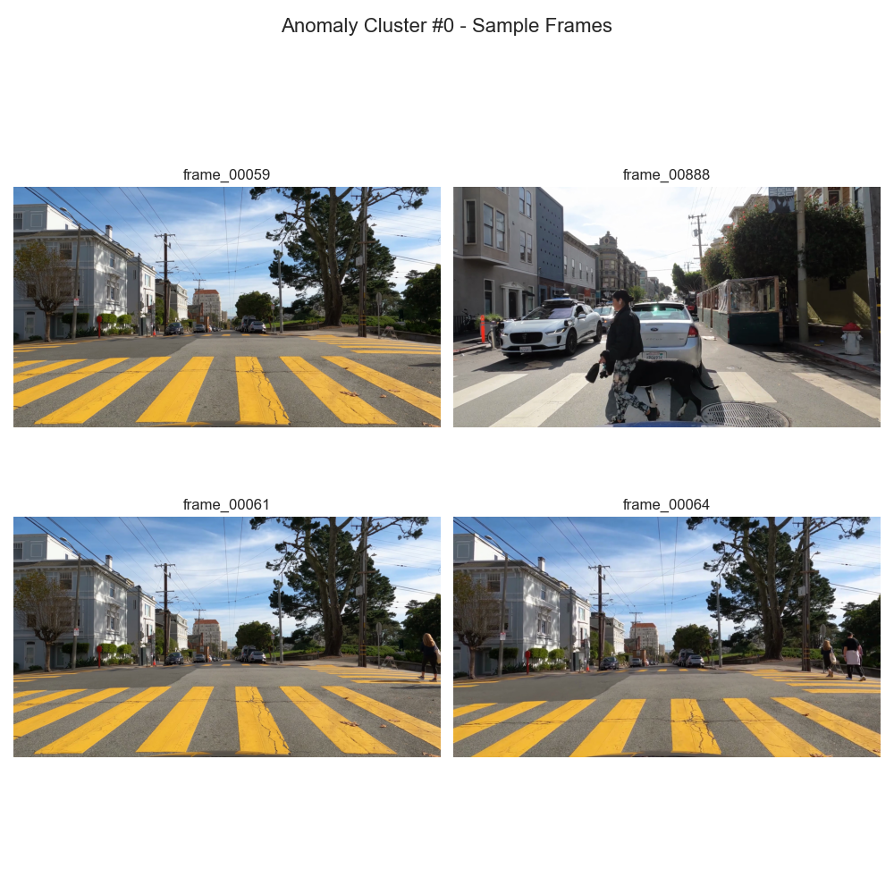
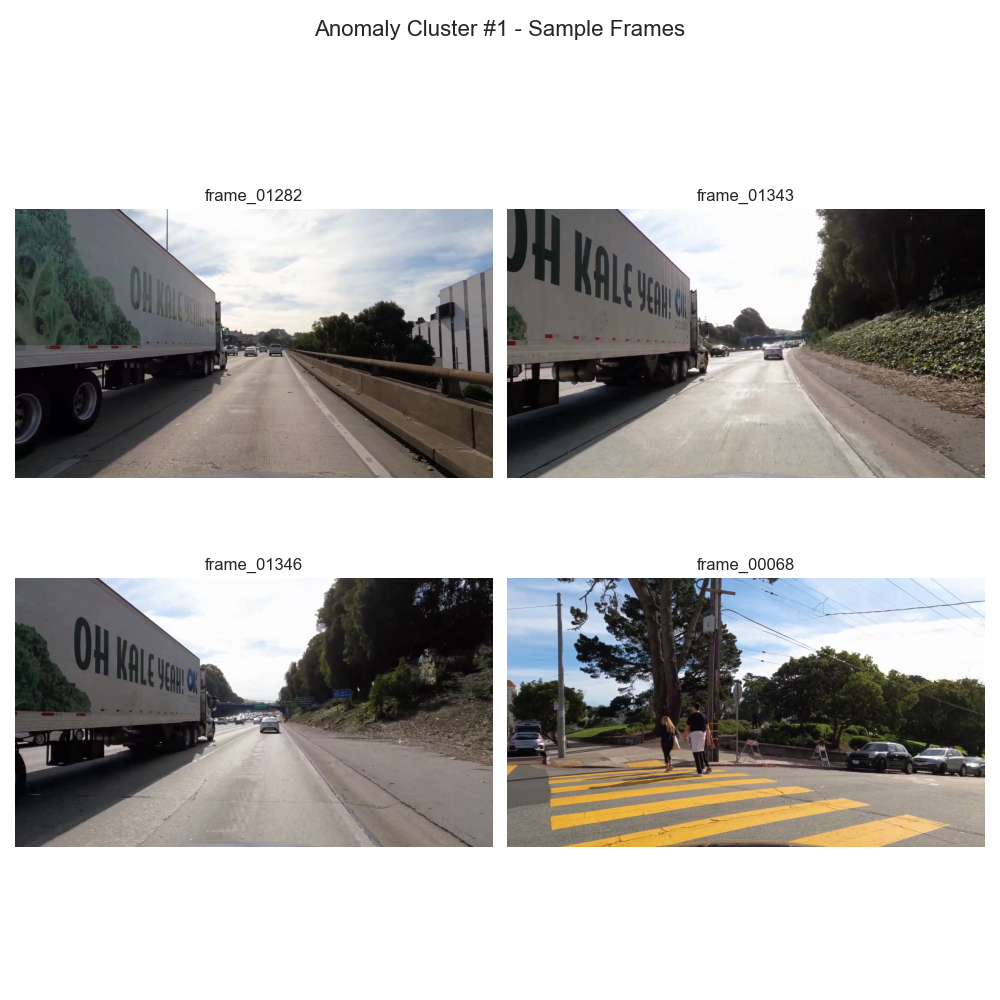

# Unsupervised Anomaly Detection in Driving Scenes using Multi-Modal Feature Fusion

## 🚀 Introduction

This project presents an end-to-end pipeline for **unsupervised anomaly detection** in automotive driving data. The system automatically discovers rare, interesting, and potentially critical driving scenarios from raw video footage without any manual labels.

The core of this project is a **multi-modal feature fusion** approach, where information from different data sources is combined to create a rich, high-dimensional representation of each moment. This allows the system to identify anomalies based not just on visual appearance, but also on object composition and scene dynamics.

**Technologies Used:** Python, PyTorch, OpenCV, `scikit-learn`, `pandas`, YOLO11, Vision Transformer (ViT), UMAP, HDBSCAN.


## 🛠️ Methodology

The central hypothesis is that an anomalous scene is defined by an unusual combination of its characteristics. To capture this, we engineer and fuse three distinct feature vectors for every frame:

1.  **Vector 1: Deep Visual Embeddings (The "Look")**
    *   A **Vision Transformer (ViT)** pre-trained on ImageNet is used to generate a 768-dimensional vector that summarizes the entire scene's visual context, including textures, shapes, and colors.

2.  **Vector 2: Object-Level Features (The "Composition")**
    *   A **YOLO11** model generates perception data (bounding boxes and classes). From this, we engineer features like object counts, scene diversity, spatial layout, and proximity metrics.

    ### Key Object-Level Features Engineered
    To move beyond simple counts, we designed features to describe the scene's complexity, spatial layout, and potential risk.

    #### Category 1: Scene Complexity & Diversity
    *   `**scene_diversity_score**`: Measures scene complexity by counting the number of unique object classes present (e.g., `car`, `person`, `bicycle`).
    *   `**total_object_area_ratio**`: Indicates screen "clutter" by summing the area of all detected object bounding boxes.
    *   `**log_vehicle_to_vru_ratio**`: A numerically stable, log-transformed ratio of vehicles to Vulnerable Road Users (VRUs), capturing the transition between highway and urban scenes.

    #### Category 2: Spatial Layout & Proximity
    *   `**num_objects_in_center_lane**`: Identifies potential immediate hazards by counting objects in the direct, central path of travel.
    *   `**avg_y_center_of_vehicles**`: Detects changes in road gradient (hills) or unusual vertical vehicle positions (e.g., a car on a tow truck).
    *   `**num_large_objects**`: Flags scenes dominated by close-proximity objects, like being next to a large truck or in a traffic jam.

    #### Category 3: Anomaly & Risk Indicators
    *   `**is_vru_present**`: A critical binary flag indicating the presence of any Vulnerable Road User (person, bicycle).
    *   `**is_anomalous_static_object_present**`: Finds "out-of-place" objects, such as a stop sign on a highway, indicating a major context shift.
    *   `**min_confidence**`: Acts as a proxy for perception model uncertainty, highlighting scenes where the model is struggling to make confident detections.

3.  **Vector 3: Scene Dynamics Features (The "Motion")**
    *   **OpenCV's Optical Flow** is used to calculate the motion of pixels between consecutive frames, creating features that act as a proxy for the ego-vehicle's speed and turning behavior.

These vectors are fused into a single matrix, which is then fed into an **Isolation Forest** model to calculate an anomaly score for each frame. Finally, advanced visualization and clustering techniques (**UMAP + HDBSCAN**) are used to analyze and categorize the discovered anomalies.


## ⚙️ Project Pipeline

The project is structured as a series of sequential scripts that form a complete data processing and analysis pipeline.

### 1. Data Preparation & Perception
*   `1_extract_frames.py`: Extracts frames from a source video at a fixed rate (1 FPS).
*   `2_run_perception_with_validation.py`: Simulates a perception system using YOLO11 to generate object detection and segmentation data for each frame, saving the output to structured JSON files.

### 2. Feature Engineering & Fusion
*   `3_create_visual_embeddings.py`: Uses a pre-trained Vision Transformer (ViT) to generate a rich visual feature vector for each frame.
*   `4_create_object_features.py`: Reads the YOLO11 perception data and engineers a set of features describing the scene's composition and spatial layout.
*   `5_create_motion_features.py`: Calculates optical flow between frames to generate features describing the scene's motion dynamics.
*   `6_fuse_features.py`: Loads the three feature sets, aligns them by frame, and fuses them into a single master feature matrix.

### 3. Unsupervised Modeling & Analysis
*   `7_train_isolation_forest.py`: Loads the final fused data, applies standard scaling, and trains an Isolation Forest model to score each frame for anomalousness.
*   `8_visualize_results.py`: Generates a comprehensive visual report, including a time-series plot, a deep-dive into top anomalies, and an advanced cluster analysis of anomaly types.

## 🔮 Future Work & Potential Improvements

This project serves as a strong foundation. Several exciting avenues exist for future development:

*   **Advanced Anomaly Detection Models:**
    *   Implement an **Autoencoder** or **Variational Autoencoder (VAE)**. These deep learning models could potentially capture more complex, non-linear relationships in the data. A high reconstruction error would serve as the anomaly score.
    *   Incorporate **temporal models** like an **LSTM-Autoencoder**. This would allow the model to learn the expected *sequence* of events and flag anomalies based on unusual temporal patterns (e.g., a feature value changing too quickly).

*   **Enhanced Feature Engineering:**
    *   **Robust Scaling:** Replace `StandardScaler` with a `QuantileTransformer` or apply a log transform to more features to better handle extreme outliers and improve model stability.
    *   **Segmentation Mask Features:** Utilize the segmentation masks from YOLO11 to engineer features related to object **shape and orientation**. This could help detect accidents (deformed cars) or unusual object poses.

*   **Scaling Up:**
    *   Apply the pipeline to a large-scale, annotated dataset like **nuScenes** or **Waymo**. This would allow for a more quantitative evaluation of how well the unsupervised system discovers pre-labeled "interesting" events.

## 📊 Results & Analysis

The pipeline was run on a sample driving video containing a mix of urban and highway scenarios. The results successfully demonstrate the system's ability to identify and categorize anomalous events.

### Section 1: Time-Series Anomaly Analysis


**Analysis:**
The time-series plot provides a macro-level view of the entire driving sequence. The Y-axis represents the anomaly score calculated by the Isolation Forest model, where higher peaks indicate moments that are more anomalous.

*   **Key Finding:** The driving experience was highly dynamic, with clear periods of anomalous events. The model did not just output random noise but identified specific temporal segments as being statistically different from the baseline.
*   **Observation:** There are several prominent peaks that cross the 99th percentile threshold, notably around frames 50-70, a spike at frame 888, and a prolonged period of high anomaly scores between frames 1300-1400. This indicates that our "Hall of Fame" and cluster analysis will likely draw from these specific moments.

---

### Section 2: "Hall of Fame" - Deep Dive into Top Anomalies

This section dissects the highest-scoring individual frames to understand the root cause of their anomaly scores.

**Analysis of Top Anomaly #1: `frame_01395` (The Tanker Truck)**

*   **Scene Description:** The ego-vehicle is on a highway, closely following a large, white tanker truck.
*   **Feature Spotlight Breakdown:** The anomaly is driven by a combination of unusual motion dynamics from being close to a large object and unique visual features from the truck's reflective, cylindrical shape, which the Vision Transformer flagged as a rare pattern (`visual_257`, `visual_59`).

**Analysis of Top Anomaly #2: `frame_00057` (The Yellow Crosswalk)**

*   **Scene Description:** The vehicle is approaching a bright yellow, block-style crosswalk at an urban intersection.
*   **Feature Spotlight Breakdown:** The dominant signal is the `visual_530` feature. The Vision Transformer correctly identifies the large-scale, high-contrast geometric pattern of the crosswalk as a significant visual deviation from normal asphalt roads.

**Analysis of Top Anomaly #6: `frame_00888` (Pedestrian and Self-Driving Car)**

*   **Scene Description:** A critical urban scene with a pedestrian and dog crossing directly in front of the car, next to a Jaguar I-PACE (a common self-driving test vehicle).
*   **Feature Spotlight Breakdown:** This is a perfect example of multi-modal success. The high score is a result of a confluence of factors: complex visual patterns, a slow/stopped motion profile, and the presence of Vulnerable Road Users (VRUs).

---

### Section 3: Anomaly Cluster Analysis



**Analysis:**
The UMAP projection provides powerful evidence that our system can distinguish between **different *types*** of anomalies. The anomalous data points form two clear and distinct clusters, allowing us to automatically categorize the edge cases found.

**Cluster #0: "Complex Urban Intersections"**

*   **Visual Theme:** This cluster is dominated by the yellow crosswalk and the pedestrian/dog scene.
*   **Interpretation:** This cluster represents events characterized by **urban infrastructure and vulnerable road users (VRUs)**. These are low-speed but high-complexity scenarios where the visual scene and object composition are highly unusual.

**Cluster #1: "Highway Object Proximity"**

*   **Visual Theme:** This cluster is primarily composed of scenes where the ego-vehicle is driving in very close proximity to large trucks on the highway.
*   **Interpretation:** This cluster represents events characterized by **large objects dominating the visual field in a high-speed context**. The key drivers are a combination of large bounding box areas, unique visual signatures of truck surfaces, and complex optical flow patterns.

## 🏁 Conclusion

This project successfully demonstrates an end-to-end unsupervised learning system for identifying and categorizing rare events in automotive data. By fusing features from state-of-the-art visual models, object detection outputs, and motion dynamics, the system was able to:

1.  **Discover Salient Events:** Automatically flagged key moments involving unusual road markings, close-proximity large vehicles, and critical pedestrian interactions.
2.  **Provide Root-Cause Analysis:** The feature spotlight allowed for a deep dive into *why* a scene was considered anomalous.
3.  **Categorize Anomaly Types:** The UMAP and HDBSCAN clustering successfully separated anomalies into distinct groups, proving the system can find patterns among the edge cases.

This methodology provides a powerful, scalable solution for accelerating the validation and testing of autonomous driving perception systems.

## 🔧 How to Run

### Prerequisites
*   Python 3.10+
*   `pip` for package installation

### Installation
1.  Clone the repository:
   
2.  Install the required packages:
    ```bash
    pip install -r requirements.txt
    ```
    ```
    # requirements.txt
    opencv-python
    ultralytics
    torch
    torchvision
    timm
    pandas
    numpy
    scikit-learn
    umap-learn
    hdbscan
    matplotlib
    seaborn
    ```

### Running the Pipeline
1.  Place your source video file (e.g., `my_video.mp4`) in the root directory. Update the `VIDEO_PATH` variable in `1_extract_frames.py`.I downloaded a youtube video - https://www.youtube.com/watch?v=yTmFsd7E4BU

2.  Run the scripts sequentially from your terminal:
    ```bash
    python 1_extract_frames.py
    python 2_run_perception_with_validation.py
    python 3_create_visual_embeddings.py
    python 4_create_object_features.py
    python 5_create_motion_features.py
    python 6_fuse_features.py
    python 7_train_isolation_forest.py
    python 8_visualize_results.py
    ```
3.  All data outputs will be saved in the `data/` directory, and the final visual report will be generated in the `report/` directory.