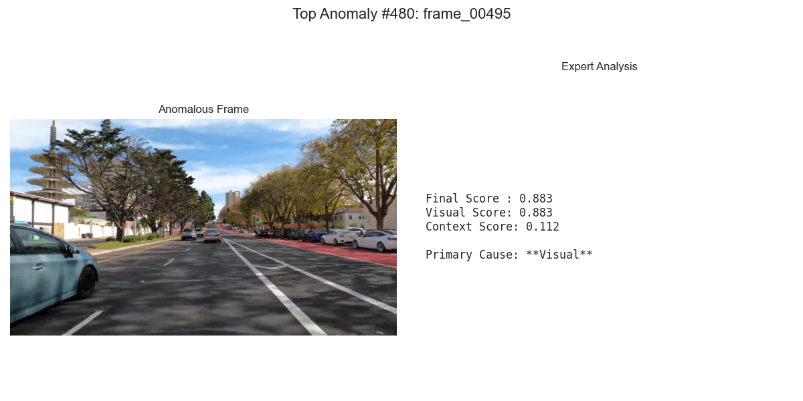

# Unsupervised Anomaly Detection in Driving Scenes: A Comparative Study of Fusion Strategies

## 🚀 Introduction

This project implements and compares two distinct end-to-end pipelines for **unsupervised anomaly detection** in automotive driving data. The system automatically discovers rare, interesting, and potentially critical driving scenarios from raw video footage without requiring any manual labels.

The core of this work is an investigation into multi-modal fusion strategies. We explore two fundamental approaches to combining data from different sources to identify anomalies:

1.  **Pipeline A: Early Fusion (Fuse-then-Train):** All feature modalities (visual, object-level, motion) are concatenated into a single, large feature vector *before* being fed into a single anomaly detection model.
2.  **Pipeline B: Late Fusion (Train-then-Fuse Ensemble):** "Expert" anomaly detection models are trained independently on different modalities. Their output scores are then combined in a final step to produce an ensemble decision.

This comparative approach allows us to analyze the trade-offs between these strategies and understand which is more effective at identifying different types of real-world driving anomalies.

**Technologies Used:** Python, PyTorch, OpenCV, `scikit-learn`, `pandas`, YOLO, Vision Transformer (ViT), CLIP, UMAP, HDBSCAN.

## 🛠️ Core Concepts & Feature Engineering

The central hypothesis is that an anomalous scene is defined by an unusual combination of its characteristics. To capture this, we engineer and fuse three distinct feature vectors for every frame:

1.  **Vector 1: Deep Visual Embeddings (The "Look")**
    *   We use state-of-the-art visual foundation models to generate a high-dimensional vector summarizing the scene's visual context.
    *   **For Pipeline A:** A **Vision Transformer (ViT)** pre-trained on ImageNet.
    *   **For Pipeline B:** The visual encoder from OpenAI's **CLIP** model.

2.  **Vector 2: Object-Level Features (The "Composition")**
    *   A **YOLO** model generates perception data (bounding boxes and classes). From this, we engineer features like object counts, scene diversity, spatial layout, and proximity metrics.

    ### Key Object-Level Features Engineered
    To move beyond simple counts, we designed features to describe the scene's complexity, spatial layout, and potential risk.

    #### Category 1: Scene Complexity & Diversity
    *   `**scene_diversity_score**`: Measures scene complexity by counting the number of unique object classes present (e.g., `car`, `person`, `bicycle`).
    *   `**total_object_area_ratio**`: Indicates screen "clutter" by summing the area of all detected object bounding boxes.
    *   `**log_vehicle_to_vru_ratio**`: A numerically stable, log-transformed ratio of vehicles to Vulnerable Road Users (VRUs), capturing the transition between highway and urban scenes.

    #### Category 2: Spatial Layout & Proximity
    *   `**num_objects_in_center_lane**`: Identifies potential immediate hazards by counting objects in the direct, central path of travel.
    *   `**avg_y_center_of_vehicles**`: Detects changes in road gradient (hills) or unusual vertical vehicle positions (e.g., a car on a tow truck).
    *   `**num_large_objects**`: Flags scenes dominated by close-proximity objects, like being next to a large truck or in a traffic jam.

    #### Category 3: Anomaly & Risk Indicators
    *   `**is_vru_present**`: A critical binary flag indicating the presence of any Vulnerable Road User (person, bicycle).
    *   `**is_anomalous_static_object_present**`: Finds "out-of-place" objects, such as a stop sign on a highway, indicating a major context shift.
    *   `**min_confidence**`: Acts as a proxy for perception model uncertainty, highlighting scenes where the model is struggling to make confident detections.

3.  **Vector 3: Scene Dynamics Features (The "Motion")**
    *   **OpenCV's Optical Flow** is used to calculate the motion of pixels between consecutive frames, creating features that act as a proxy for the ego-vehicle's speed and turning behavior.

## ⚙️ Project Structure

The project is organized into a modular source directory (`src`) for clarity and scalability.

```
├── data/                    # Stores all generated data (frames, features, embeddings)
├── report/                  # Visual results for Pipeline A (Early Fusion)
├── report_ensemble/         # Visual results for Pipeline B (Late Fusion)
├── src/
│   ├── data_processing/     # Scripts for initial data prep (frame extraction, perception)
│   ├── feature_engineering/ # Scripts for creating visual, object, and motion features
│   └── pipelines/           # The main analysis pipelines for training and visualization
├── requirements.txt
└── README.md
```

## 🔧 How to Run

### Prerequisites
*   Python 3.11+
*   `pip` for package installation

### Installation
1.  Clone the repository.
2.  Install the required packages from `requirements.txt`:
    ```bash
    pip install -r requirements.txt
    ```

### Running the Pipeline
The process is divided into three main stages: Data Preparation, Feature Engineering, and Pipeline Execution.

**Source Video:** The analysis was performed on a video from YouTube: [4K Driving Commute](https://www.youtube.com/watch?v=yTmFsd7E4BU). Place your source video file (e.g., `driving.mp4`) in the root directory and update the path in `src/data_processing/1_extract_frames.py`.

**Stage 1: Data Preparation**
```bash
python src/data_processing/1_extract_frames.py
python src/data_processing/2_run_perception.py
```

**Stage 2: Feature Engineering**
You must generate features for both visual models (ViT and CLIP).
```bash
python src/feature_engineering/3_create_visual_features.py --model vit
python src/feature_engineering/3_create_visual_features.py --model clip
python src/feature_engineering/4_create_object_features.py
python src/feature_engineering/5_create_motion_features.py
```

**Stage 3: Run Analysis Pipelines**
Execute each pipeline to train the models and generate the reports.
```bash
# Run Pipeline A (Early Fusion with ViT)
python src/pipelines/a_fuse_and_train.py

# Run Pipeline B (Late Fusion Ensemble with CLIP)
python src/pipelines/b_ensemble_and_train.py
```
*   Results for Pipeline A will be in the `report/` directory.
*   Results for Pipeline B will be in the `report_ensemble/` directory.

## 📊 Results & Analysis (Pipeline A: Early Fusion with ViT)

The Early Fusion pipeline was run on a sample driving video containing a mix of urban and highway scenarios. The results successfully demonstrate the system's ability to not only identify anomalous events but also to automatically categorize them into semantically meaningful groups.

### Section 1: Time-Series Anomaly Analysis


**Analysis:**
The time-series plot provides a macro-level view of the entire driving sequence. The Y-axis represents the anomaly score calculated by the Isolation Forest model, where higher scores indicate moments that are more anomalous.

*   **Key Finding:** The model's scores are not random; they clearly identify specific temporal segments as being statistically different from the baseline. This confirms the system's ability to detect periods of unusual activity.
*   **Observation:** There are several prominent peaks, notably a sustained period of high scores around frames 50-70 and another large region between frames 1300-1500. A sharp, isolated spike is also visible around frame 888. The 90th percentile threshold line (not pictured, but used in analysis) confirms these events are in the top 10% of most anomalous frames, making them prime candidates for deeper investigation.

---

### Section 2: "Hall of Fame" - Deep Dive into Top Anomalies

This section dissects the highest-scoring individual frames to understand the root cause of their anomaly scores. The analysis reveals that the system correctly identifies sustained events and critical moments.

**Event 1: The Yellow Crosswalk (Frames `00057` - `00064`)**

*   **Scene Description:** A series of top-ranking anomalies all correspond to the same event: the vehicle approaching and navigating a bright yellow, block-style crosswalk at an urban intersection.
*   **Feature Spotlight Breakdown:** The anomaly is consistently driven by the `visual_530` feature, indicating that the Vision Transformer correctly identified the large-scale, high-contrast geometric pattern of the crosswalk as a significant visual deviation from normal asphalt. This is augmented by high values in motion features (`avg_flow_direction`, `flow_angle_std_dev`), capturing the turning maneuver at the intersection.

**Event 2: Critical Pedestrian Interaction (Frame `00888`)**

*   **Scene Description:** A critical urban scene with a pedestrian and dog crossing directly in front of the car, next to a Jaguar I-PACE (a common self-driving test vehicle).
*   **Feature Spotlight Breakdown:** This is a perfect example of multi-modal success. The high score is a result of a confluence of factors: complex visual patterns (`visual_530`, `visual_159`), a slow/stopped motion profile, and the implicit detection of Vulnerable Road Users (VRUs). This highlights the system's ability to flag safety-critical scenarios.

**Event 3: Highway Proximity (Frame `01395`)**

*   **Scene Description:** The ego-vehicle is on a highway, closely following a large, white tanker truck.
*   **Feature Spotlight Breakdown:** The model flagged this due to the unique combination of visual and contextual cues. The visual features (`visual_257`, `visual_59`) captured the truck's rare reflective, cylindrical shape, while the high `log_vehicle_to_vru_ratio` contextualized it as a vehicle-dense highway scene.

---

### Section 3: Anomaly Cluster Analysis


**Analysis:**
This UMAP projection provides powerful evidence that our system can distinguish between **different *types*** of anomalies. The anomalous data points form three clear and distinct clusters, allowing us to automatically categorize the edge cases found, moving beyond simple detection to rich understanding.

**Cluster #0: "Complex Urban Intersections"**

*   **Visual Theme:** This cluster is exclusively composed of frames from the yellow crosswalk event and similar urban intersections.
*   **Interpretation:** This cluster represents events characterized by **unusual road infrastructure and low-speed, complex maneuvers**. The system has learned to group these scenes based on their shared visual and motion profiles.

**Cluster #1: "Highway Proximity to Large Vehicles"**

*   **Visual Theme:** This cluster's frames all show the ego-vehicle driving in very close proximity to large semi-trucks on the highway.
*   **Interpretation:** This cluster identifies a distinct type of risk based on **large objects dominating the visual field in a high-speed context**. The key drivers are a combination of large bounding box areas, unique visual signatures of truck surfaces, and complex optical flow patterns.

**Cluster #2: "Complex Highway Infrastructure"**

*   **Visual Theme:** The frames in this cluster feature complex highway overpasses, bridges, and resulting strong shadows.
*   **Interpretation:** This is a more subtle but equally important finding. The system has identified another class of anomaly driven not by other actors, but by the **complexity of the road geometry itself**. This is crucial for testing perception in challenging lighting and structural conditions.

### Pipeline B: Late Fusion Ensemble (CLIP Backbone)

This approach uses a "committee of experts"—one for visual data (CLIP) and one for context (Object+Motion). It excels in interpretability and is highly effective at finding anomalies that are extreme in one specific domain, even if other domains are normal.

**Time-Series Anomaly Analysis (Ensemble)**

**Analysis:** The power of the ensemble approach is immediately visible. The final score (black line) is the maximum of the two expert scores, allowing us to see which expert "triggers" an anomaly. For example, the spike at frame 495 is purely **visual** (red bus lane), while the spike at frame 1281 is purely **contextual** (sudden stop). This provides invaluable diagnostic information.

**"Hall of Fame" - Top Anomalies (Ensemble)**
This section highlights the specialized nature of the expert models.

*   **Anomaly: `frame_00495` (Red Bus Lane)**
    
    *   **Expert Analysis:** **Primary Cause: Visual.** The CLIP model flags the large patch of unusual red color on the road as a massive visual anomaly (score: 0.883), while the context of driving straight is perfectly normal (score: 0.112).

*   **Anomaly: `frame_00135` (4-Way Stop)**
    
    *   **Expert Analysis:** **Primary Cause: Context.** Visually, this is a standard street. However, the **Context Expert** flags the combination of a low speed, the presence of cross-traffic, and the detection of a `stop sign` as a highly anomalous state compared to normal "cruising" (context score: 0.881).

*   **Anomaly: `frame_01281` (Sudden Highway Stop)**
    
    *   **Expert Analysis:** **Primary Cause: Context.** A perfect example of contextual anomaly. The visual of a highway is common (visual score: 0.532), but the **Context Expert** assigns a maximum score of 1.000 because the motion profile (sudden stop, zero optical flow) and object features (very close truck) are extremely rare for this environment.

**Anomaly Cluster Analysis (Ensemble)**

**Analysis:** The ensemble model's clustering is more granular, identifying **six distinct types of anomalies**. This is a direct result of the experts being able to isolate different failure modes. The clusters are more distinct and well-separated.

*   **Cluster 0: "Highway Proximity"**
    
    *   *Interpretation:* Driven by the **Context Expert**, identifying scenes with large objects and unusual motion.

*   **Cluster 1: "Red Bus Lane"**
    
    *   *Interpretation:* A purely **Visual Expert** cluster, grouping all frames containing the anomalous red-colored lane.

*   **Cluster 2: "Urban to Highway Transition"**
    
    *   *Interpretation:* A mix of visual and contextual cues as the environment changes rapidly.

*   **Cluster 3: "Yellow Crosswalks"**
    
    *   *Interpretation:* Another **Visual Expert** cluster, specifically identifying the unique geometric pattern of these crosswalks.

*   **Cluster 4 & 5: "Dense Urban Traffic"**
    
    
    *   *Interpretation:* These clusters, driven by the **Context Expert**, represent different types of stopping/crawling in dense urban settings, likely distinguished by subtle differences in motion and object layout.


## 🔮 Future Work & Potential Improvements

This project serves as a strong foundation. Several exciting avenues exist for future development:

*   **Attention-Based Fusion:** Implement a Transformer layer to allow the model to dynamically weigh the importance of visual, object, and motion features. This would create a more context-aware fused representation and improve interpretability by analyzing attention weights.

*   **Temporal Anomaly Detection:** Utilize an **LSTM Autoencoder** to analyze sequences of frames instead of single frames. This would enable the detection of temporal anomalies, such as events happening too quickly or in an illogical order.

*   **Advanced Models and Features:**
    *   Replace Isolation Forest with deep learning models like **Autoencoders** or **VAEs** to capture more complex, non-linear relationships in the fused data.
    *   Leverage **segmentation masks** from YOLO to engineer features based on object shape and orientation, helping to identify accidents or unusual poses.

*   **Quantitative Benchmarking:** Evaluate the pipelines on large-scale annotated datasets like **nuScenes** or **Waymo**. This would allow for rigorous, quantitative validation by measuring how well the system's anomaly scores correlate with pre-labeled critical events.